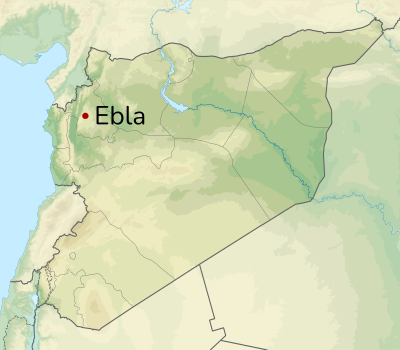

# Vocabolario di Ebla

The *Vocabolario di Ebla* is a comprehensive bilingual list or glossary compiled by the scribes of the ancient city of [Ebla](https://pleiades.stoa.org/places/869702586) around 2370 BCE. The list is a collection of Sumerian words and terms, with some of these also featuring translations or paraphrases in Eblaite. Scholars have identified at least four different manuscripts or "versions" of this glossary, and they have been engaged in reconstructing them from dozens of fragments over the past fifty years. 

The *Vocabolario* serves as an indispensable tool for linguists, historians, and archaeologists who are dedicated to studying the Eblaite language and the ancient city itself. It plays a crucial role in enabling researchers to decode the meanings of Eblaite words, comprehend the grammatical structure of the language, and acquire insights into the vocabulary used by the people of Ebla.

